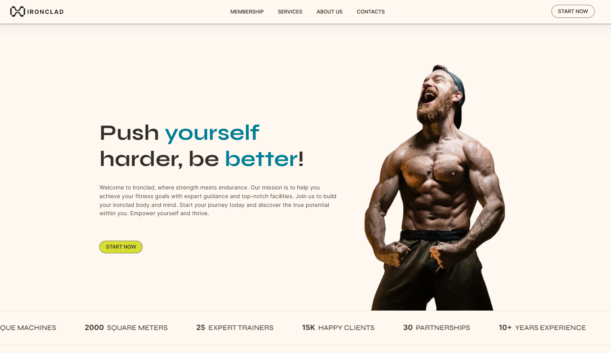

# Frontend project: Ironclad

Welcome to Ironclad, a comprehensive gym webpage designed to help you achieve your fitness goals. With a suite of features including BMI calculation, personalized fitness plans, exercise tutorials, and more, Ironclad provides all the tools you need to build a stronger body and mind.

## Screenshots

## Features

- Main Page: Includes a testimonials section where members share their success stories and experiences at Ironclad.
- Membership Page: Detailed information about our membership plans, pricing, and benefits.
- Services Page:
  - BMI Calculation: Easily calculate your Body Mass Index (BMI), based on your height and weight to understand your current fitness level.
  - Personalized Fitness Plans: Get tailored fitness plans based on your BMI and your specific fitness goals such as weight reduction, muscle gain, or hypertrophy.
  - Exercise Tutorials: Learn how to perform exercises correctly with detailed animations and instructions.
- About Us Page: Meet our expert team and learn about our partners who help us bring the best services to you.
- Contacts Page: Find detailed information about our location, including a map, and a form for any questions you may have.
- Start Now Page: Sign up for a membership and start your fitness journey with our easy-to-use signup form.
- Blog Page: Read posts from the Ironclan community about their fitness journeys, tips, and motivational stories.

## Getting Started

1. Install Dependencies

<pre>

npm install

</pre>

2. Run JSON server on http://localhost:5000

<pre>

npm run server

</pre>

3. Open your browser and visit http://localhost:5173 to see the Ironclad webpage in action.

<pre>

npm run dev

</pre>

## Technologies Used

- React: For building the user interface.
- JavaScript: For the dynamic functionality.
- React: For building the user interface.
- SCSS: For styling the components.

### Some of the main dependencies used

- JSON Server - json-server
- Usehooks- @uidotdev/usehooks (react utilities)
- Splide.js React - @splidejs/react-splide (sliders)
- Framer Motion - framer-motion (animations)
- React Hook Form && Yup - react-hook-form && Yup (form validation)
- [Mapbox Directions](https://docs.mapbox.com/mapbox-gl-js/example/mapbox-gl-directions/) - @mapbox/mapbox-gl-directions
- [Mapbox GL](https://docs.mapbox.com/mapbox-gl-js/api/) - mapbox-gl
- React PDF Renderer - @react-pdf/renderer

### APIs used

- Context API - used to help create the blog section and manage the creation, update, and deletion of posts.
- [ExerciseDB](https://rapidapi.com/justin-WFnsXH_t6/api/exercisedb) - database API containing 1300+ exercises with body part, target muscle, instructions and a follow-through animation.
- [Mapbox](https://docs.mapbox.com/mapbox-gl-js/example/mapbox-gl-directions/) - to create a personalized map with Ironclad location and navigation features.

## Next Steps

- Improve UX/UI: Enhance the user experience and interface design to make navigation and interaction more intuitive and visually appealing.

- Integrate Backend Services: Implement a backend to power the entire application, especially for handling forms and user data. This will ensure scalability, security, and better management of user interactions.

- Workout Registration Functionality: Develop a feature that enables users to register their workouts, including the days they went to the gym and track the weights used per workout. This will provide users with valuable insights into their fitness progress and help them set and achieve their goals more effectively.

- Implement Cookies, Privacy, and Terms: Ensure compliance with privacy regulations and enhance user trust by adding cookie consent functionality, a privacy policy, and terms of service. This will protect user data and provide transparency about how their information is used.

By focusing on these next steps, Ironclad can continue to evolve and provide an even better experience for its users, helping them reach their fitness goals with confidence and ease.
